# DataOps - Laboratório 7

Processmento e Análise de Dados com Amazon EMR

As instruções do laboratório estão em português. Para alterar o idioma, procure a opção na barra inferior do console AWS.


## Objetivos

* Utilizar AWS EMR para ler um arquivo do S3

* Utilizar Apache Hive para fazer consulta nos dados

* Exportar dados para DynamoDB


## Arquitetura da solução


## Criar um cluster EMR

Amazon EMR é o serviço da AWS que provisiona Hadoop MapReduce e outras soluções de análise de dados em clusters de instâncias AWS. Vamos provisionar um cluster EMR com um nó Principal, que controla as execuções, e dois nós de Serviço, que realmente executam as tarefas.

1. Procure na barra superior pelo serviço `EMR` e clique no serviço para abrir

2.	No menu ao lado esquerdo clique em `Clusters`


3. Crie um cluster EMR com as seguintes configurações:

    3.1. `Nome`: `ClusterVacinas`

    3.2. Em `Pacotes de Serviços` selecione os serviços da imagem abaixo (o número da versão pode ser diferente):

    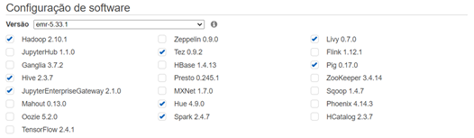

    3.3. Em `Configurações do Catálogo de Dados do AWS Glue` selecione as duas opções

    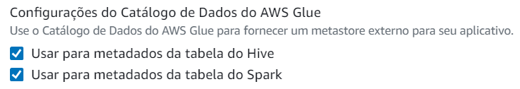


    3.4. Em `Grupos de instâncias` escolha uma instância do tipo `m4.large` para os nós `Primário`, `Núcleo` e `Tarefa 1 de 1`

    

    

    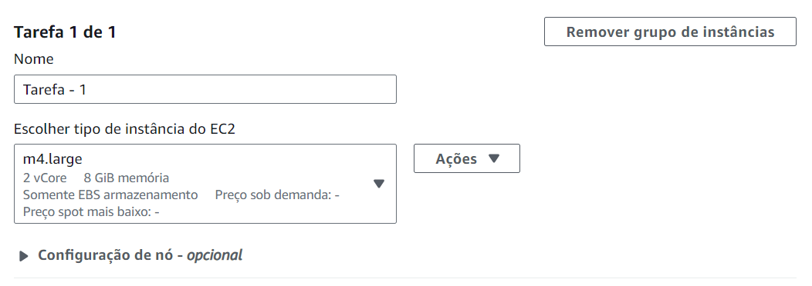


    3.5. Na seção `Configuração de segurança e par de chaves do EC2 - opcional`, em `Par de chaves do Amazon EC2 para o SSH do cluster` escolha a `vockey`

    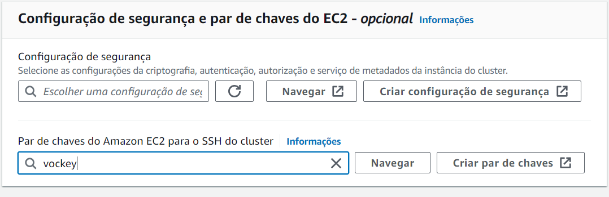

    3.6. Na seção `Perfil de serviço do Amazon EMR` em `Função de serviço` escolha `EMR_DefaulRole`

    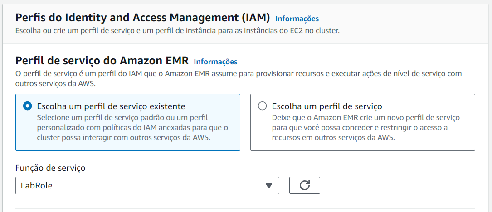

    3.7. Na seção `Perfil de instância do EC2 para o Amazon EMR` em `Função de serviço` escolha `EMR_EC2_DefaulRole`

    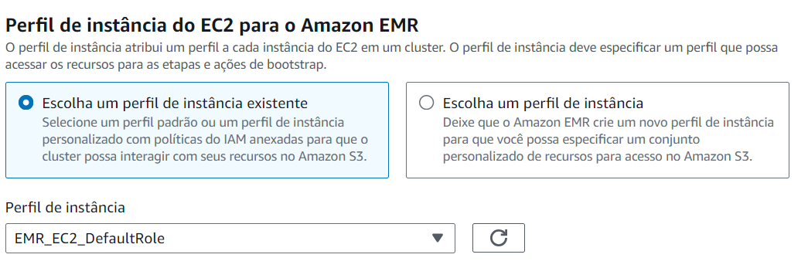

    3.8. Clique em `Criar cluster`

4. O cluster será iniciado. Aguarde até que o status `Aguardando` apareça

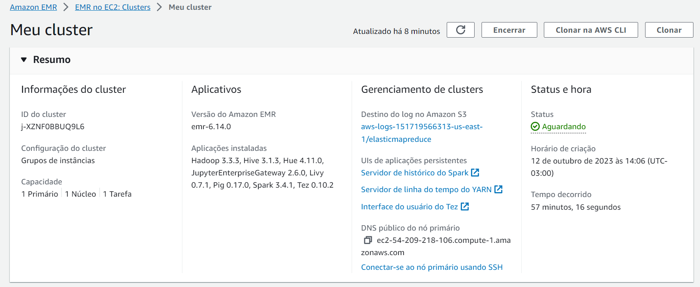


5.	Enquanto o cluster inicia vamos configurar o grupo de segurança para poder acessar a instância principal do cluster EMR a partir de uma conexão SSH no CloudShell

    5.1. Na tela de detalhes do cluster EMR (tela aberta depois que o cluster foi criado) procure pela seção `Rede e segurança` e identifique a propriedade `Grupo de segurança gerenciados do EMR` expandindo a opção `Grupos de segurança do EC2 (firewall)`

    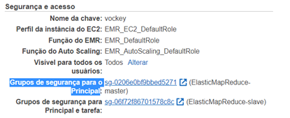

    5.2. Clique no link que começa com `sg` para abrir o grupo de segurança (security group)

    5.3. Na nova tela, nas abas da parte inferior, selecione a aba `Regras de entrada`

    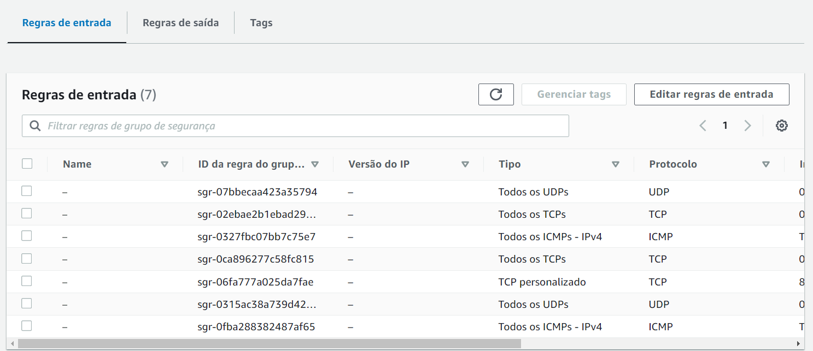


    5.4. Clique em `Editar regras de entrada`

    5.5. Na nova tela, clique em `Adicionar regra`

    5.6. Na nova regra habilite a porta 22 (SSH) com as seguintes configurações:

&nbsp;&nbsp;&nbsp;&nbsp;&nbsp;&nbsp;&nbsp;&nbsp;a. Intervalo de portas: 22

&nbsp;&nbsp;&nbsp;&nbsp;&nbsp;&nbsp;&nbsp;&nbsp;b. Origem: `Qualquer local-IPv4`

&nbsp;&nbsp;&nbsp;&nbsp;5.7. Clique em  `Salvar regras`

&nbsp;&nbsp;&nbsp;&nbsp;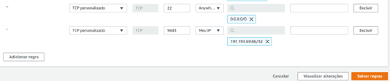

6.	Volte para o EMR e veja se já está com o status `Aguardando`


 
7.	Conecte na instância utilizando o CloudShell. Siga os passos abaixo, se ficar alguma dúvida consulte o [Laboratório 4](https://github.com/fesousa/dataops-lab4) para mais detalhes

    16.1. Ainda no EMR, copie o endereço da propriedade `DNS público do nó primário`. Deve ser algo parecido com o seguinte: `ec2-52-55-234-193.compute-1.amazonaws.com`

    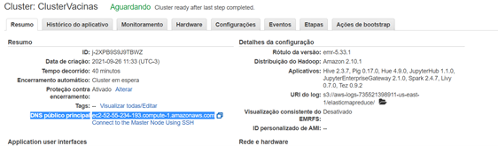
 
    7.2. No console da AWS acesse ao CloudShell clicando em  na barra superior

    7.3. Aguarde o terminal ser iniciado e verifique se o arquivo `labsuser.pem` existe executando o comando `ls`

    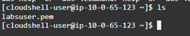
 
    Caso não tenha o arquivo, veja no [Laboratório 4](https://github.com/fesousa/dataops-lab4)como fazer o upload.

    7.4. Acesso o cluster do EMR via SSH, similar como fez para conectar na instância EC2 do Jenkins. O comando é o seguinte:

    ```bash
    ssh -i labsuser.pem hadoop@<DNS_EMR>
    ```

    Troque `<DNS_EMR>` pelo endereço copiado nos passos anteeriores

    7.5. Depois de executado o comando, digite `yes` para confirma a conexão

    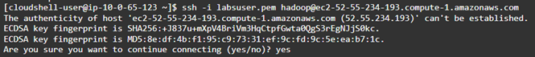
 
    16.6. Você deverá ver o seguinte no CloudShell

    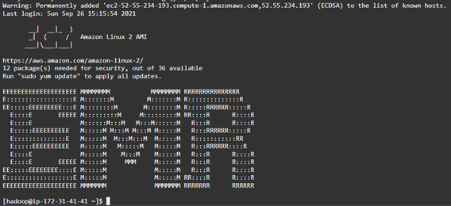
 

## Executar ETL com Spark no EMR

1.	Abra seu ambiente Cloud9, crie uma pasta lab7 na sua pasta de projetos da disciplina

2.	Na pasta lab7 crie um arquivo chamado `spark-etl-vacinas.py` e coloque o código abaixo. É um código python que utiliza o pyspark para fazer um processo de ETL com os dados de vacinas que estão no S3:
    
    2.1. Lê os dados de vacinas do S3 (extract)

    2.2. Faz transformações nos dados (seleciona colunas, renomeia colunas e faz a conta-gem dos dados agrupados - transform)

    2.3. Dalva os dados transformados no formato parquet no S3 (load)

```py
import sys
from datetime import datetime

from pyspark.sql import SparkSession
from pyspark.sql.functions import *

if __name__ == "__main__":

    # INICIAR SESSÃO SPARK
    spark = SparkSession\
        .builder\
        .appName("SparkETL")\
        .getOrCreate()

    # LER ARQUIVOS DO S3 ENVIADO COMO PARÂMETRO
    vacinas = spark.read\
                   .option("inferSchema", "true")\
                   .option("header", "true")\
                   .option("sep",";")\
                   .csv(sys.argv[1])    

    # TRANSOFRMAÇÃO DA COLUNA DE DOSE DA VACINA
    vacinas = vacinas.withColumn(
        "dose", when(vacinas.vacina_descricao_dose.contains('1'), '1')
        .when(vacinas.vacina_descricao_dose.contains('2'), '2')
        .otherwise('Única')
    )

    # REMOVER COLUNAS DESNECESSÁRIAS
    # DEIXAR APENAS AS COLUNAS QUE ESTÃO NA LISTA "colunas"
    colunas = [
        "paciente_enumSexoBiologico", 
        "estabelecimento_municipio_nome",
        "estabelecimento_uf",  
        "vacina_dataAplicacao", 
        "dose", 
        "vacina_nome"
    ]
    vacinas = vacinas.select([column for column in vacinas.columns if column in colunas])

    # RENOMEAR COLUNAS
    vacinas = vacinas.withColumnRenamed("paciente_enumSexoBiologico","sexo")\
                     .withColumnRenamed("estabelecimento_municipio_nome","municipio")\
                     .withColumnRenamed("estabelecimento_uf","uf")\
                     .withColumnRenamed("vacina_dataAplicacao","data_aplicacao")\
                     .withColumnRenamed("vacina_nome","vacina")

    # AGRUPAR E CONTAR REGISTROS
    vacinas = vacinas.groupBy("sexo","municipio","uf", "data_aplicacao", "vacina").count()
    vacinas = vacinas.withColumnRenamed("count","quantidade")

    vacinas.printSchema()

    print(vacinas.head())

    print("Quantidade de registros: " + str(vacinas.count()))

    # SALVAR NO S3 NO FORMATO PARQUET
    vacinas.write.mode("overwrite").parquet(sys.argv[2])

# spark-submit spark-etl-vacinas.py s3://dataops-impacta-dados-fernandosousa/input/ s3://dataops-impacta-dados-fernandosousa/output/spark
```

3.	Crie um novo repositório (dataops-lab7) no seu Github e envie o arquivo para o repositório na branch principal (lembre-se dos passos seguidos em labs anteriores)

4.	Volte ao CloudShell, onde está conectado no EMR e faça o seguinte:

    4.1. Verifique se a conexão ainda está ativa. Se não, abra o CloudShell novamente e reconecte no EMR como fizemos anteriormente neste laboratório

    4.2. Já conectado no EMR, instale o Git

    ```bash
    sudo yum install git
    ```

    4.3. Verifique a instalação do git

    ```bash
    git –version
    ```

    Você deve ver a versão do Git no console do CloudShell

    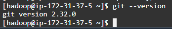

    4.4. Faça o clone do repositório criado neste laboratório

    ```bash
    git clone <url-repositorio>
    ```

    Se você criou um repositório privado, será necessário a autenticação. Para isso, é preciso criar um token quando for solicitada a senha no console do AWS CloudShell. Siga essa documentação para criar o token: https://docs.github.com/pt/github/authenticating-to-github/keeping-your-account-and-data-secure/creating-a-personal-access-token. O nome do usuário é o mesmo usuário do seu git. 

    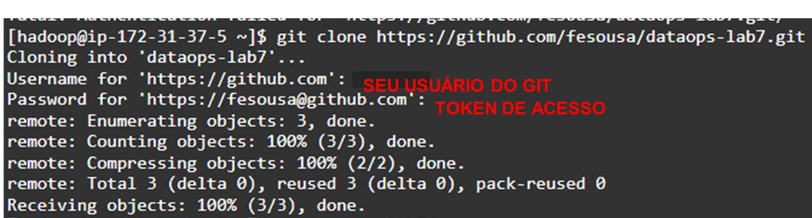


    4.5. Acesse a pasta do repositório clonado

    ```bash
    cd dataops-lab7
    ```

    Se criou o repositório com outro nome, a pasta estará diferente no seu EMR 

    4.6. Veja se o arquivo `spark-etl-vacinas.py` está na pasta com o comando `ls`

    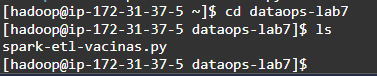


    4.7. Execute o script pyspark `spark-etl-vacinas.py` com o comando `spark-submit`:

    ```bash
    spark-submit spark-etl-vacinas.py s3://dataops-dados-nomesobrenome/input/ s3://dataops-dados-nomesobrenome/output/spark
    ```

    Lembre-se de trocar `dataops-dados-nomesobrenome` pelo seu bucket de dados (bucket criado no [Laboratório 1](https://github.com/fesousa/dataops-lab1)). Os caminhos de bucket s3 que vem depois do nome do arquivo são os parâmetros do script. O primeiro é a origem dos dados (arquivo CSV com dados brutos) e o segundo é o destino (arquivo parquet transformado). Esses parâmetros são recebidos na variável `sys.argv` no código criado. Volte ao código e identifique o uso.

    4.8. Verifique se a execução completou corretamente 

&nbsp;&nbsp;&nbsp;&nbsp;&nbsp;&nbsp;&nbsp;&nbsp;a. Verifique o log de execução no console do CloudShell e veja se não houve nenhuma exceção

&nbsp;&nbsp;&nbsp;&nbsp;&nbsp;&nbsp;&nbsp;&nbsp;b. Abra o bucket do S3 e veja se a pasta `output/spark/` foi criada com o conteúdo do parquet


## Utilizar Hive para consultar dados do Glue Data Catalog

O Apache Hive é um data warehouse e pacote analítico de código aberto. Ele facilita a leitura, escrita e gerenciamento de grandes bases de dados em armazenamento distribuídos como o Hadoop. O Hive abstrai as cargas de trabalho que utilizam Spark e MapReduce, a partir de comando SQLike (HiveQL). Com o Hive instalado no EMR é possível aproveitar as bases de dados e tabelas do catálogo de dados do Glue (Glue data catalog). Essa configuração foi feita na criação do cluster EMR. Assim podemos criar um datalake a partir de di-versas fontes de dados utilizando o Crawler e o Data Catalog do Glue, e fazer uma consulta em todas essas bases utilizando o Hive no EMR.


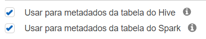

1. Ainda no CloudShell e conectado no cluster do EMR execute o CLI do Hive com o comando `hive;` 

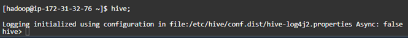

2. Dentro do Hive execute o comando abaixo para listar as bases de dados. Você deverá ver a base `vacinas_database`, criada no Glue. Se não vir a base, verifique se a base existe no Glue. Se precisar recriar, consulte o [Laboratório 6](https://github.com/fesousa/dataops-lab6).

```sql
show databases;
```

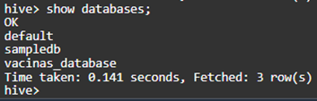


3.	Abra a base `vacinas_database`:

```sql
use vacinas_database;
```

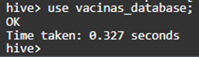

4. Agora você pode executar consultas SQL nas tabelas mapeadas no Glue, que podem vir de diferentes origens (S3, RDS, Redshift, MongoDB, DocumentDB, Kafka, etc), utilizando o processamento distribuído do Hadoop no EMR. Por exemplo, consultar a quantidade de registros na tabela `vacinas_input`, que foi criada a partir do arquivo csv no S3.

```sql
select count(1) from vacinas_input;
```

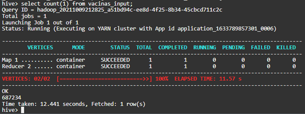

Ou então consultar quantos registros existem por UF:

```sql
select estabelecimento_uf, count(1) from vacinas_input group by estabelecimento_uf;
```

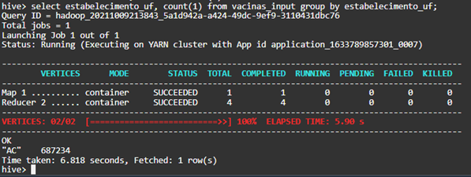


5.	Por estar utilizando o Data Catalog do Glue, quando os dados mudam na origem, a consulta em qualquer outra ferramenta que utiliza o catálogo, vai retornar os dados atualizados. Faça o teste:

    5.1. Execute a função lambda de coleta criada no [Laboratório 4](https://github.com/fesousa/dataops-lab4) para coletar os dados de Roraima (RR) que estão neste link: https://opendatasus.saude.gov.br/dataset/covid-19-vacinacao/resource/5093679f-12c3-4d6b-b7bd-07694de54173. Consulte o  [Laboratório 4](https://github.com/fesousa/dataops-lab4) para relembrar como enviar os parâmetros.

    5.2. Quando a função terminar, volte ao CloudShell para executar novamente a última consulta (quantidade de registros por UF) e veja o novo resultado, com os dados de Roraima.


## Utilizar EMR Steps para executar tarefas de Spark e Hive

O EMR consegue ser programado para executar etapas de operações de ETL a partir de códigos que estão no S3 

1.	Crie um novo script HiveQL para executar no Hive

    1.1. No VSCode adicione um novo arquivo chamado `hive_consulta_vacinas.hql` na pasta lab7 com o seguinte código de HiveQL. Ele deve estar na mesma pasta do arquivo spark-etl-vacinas.py para podermos enviar para o repositório do Github.


    https://github.com/fesousa/dataops-lab7/blob/f8a7ecf826b17a927b9aa9708665bf04210fca90/hive_consulta_vacinas.hql#L1-L37


    O script HQL faz o seguinte:
    •	Aponta para o a base `vacinas_database`, criada no Glue e configurada durante a criação do EMR para ser utilizada no Hive

    •	Remove a tabela do Hive `vacinas_dynamo`, caso exista, que contém os dados de contagem de vacinas por estado e por data, processados pelo Hive

    •	Cria a tabela `vacinas_dynamo`, com os dados de contagem de vacinas por estado e por data, processados pelo Hive. Essa é uma tabela virtual que aponta para a tabela `vacinas_uf_data` no DynamoDB

    •	Insere dados de contagem de vacinas agrupados por UF e data de aplicação na tabela `vacinas_dynamo` e por consequência na tabela `vacinas_uf_data` do DynamoDB, a partir dos dados processados da tabela `vacinas_input`. Essa, por usa vez, lê os dados do S3, que estão mapeados no Data Catalog do Glue. A tabela contém três colunas: `data_aplicacao`, `quantidade_ac` e `quantidade_rr` (quantidade em cada UF por data de aplicação)


2.	Envie para o repositório `dataops-lab7` as alterações feitas nessa pasta

3.	Crie uma nova tabela no DynamoDB com as seguintes características. Relembre o que aprendeu na disciplina de Engenharia de dados:

    3.1. Nome da tabela: `vacinas_uf_data`

    3.2. Chave de partição: `data_aplicacao`

4.	Crie um CodePipeline com as seguintes características (relembre o que já estudamos anteriormente)

    4.1. Defina um nome intuitivo para o pipeline

    4.2. Configure a Função de Serviço adequada
    

    4.3. A origem do código deve ser o repositório `dataops-lab7`, criado neste laboratório

    4.4. Não tem etapa de compilação

    4.5. Na etapa de Implantação escolha Amazon S3

&nbsp;&nbsp;&nbsp;&nbsp;&nbsp;&nbsp;&nbsp;&nbsp;a. Escolha o bucket de deploy criado na disciplina

&nbsp;&nbsp;&nbsp;&nbsp;&nbsp;&nbsp;&nbsp;&nbsp;b. Em chave do objeto coloque deploy-emr. Essa será a pasta do S3 onde o arquivo será colocado

&nbsp;&nbsp;&nbsp;&nbsp;&nbsp;&nbsp;&nbsp;&nbsp;c. Selecione a opção 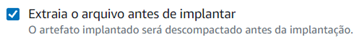

&nbsp;&nbsp;&nbsp;&nbsp;4.6. Depois de executado o pipeline verifique os objetos no bucket S3 de deploy, dentro da pasta `deploy-emr`

&nbsp;&nbsp;&nbsp;&nbsp;4.7. Se precisar relembrar alguma coisa do CodePipeline, verifique o [Laboratório 3](https://github.com/fesousa/dataops-lab3)

5. Volte para o serviço EMR

6. Abra o cluster criado (ClusterVacinas)

7. Selecione a aba 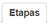

8. Clique em 

9.	No popup configure a etapa como na imagem abaixo e clique em . Para o campo `Argumentos` coloque o seguinte comando para executar o código spark a partir do arquivo no S3. Não esqueça de trocar o nome do bucket pelo seu bucket.

```bash
spark-submit s3://deploy-nomesobrenome-idconta-us-east-1/deploy-emr/spark-etl-vacinas.py s3://dataops-dados-nomesobrenome/input/ s3://dataops-dados-nomesobrenome/output/spark
```

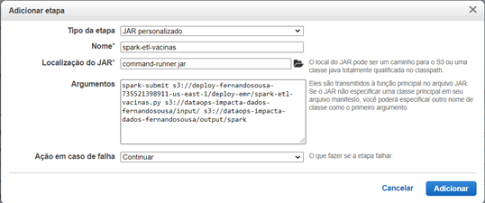

10.	Acompanhe a execução da etapa até que o Status seja . Clique em  de vez em quando para atualizar os registros.

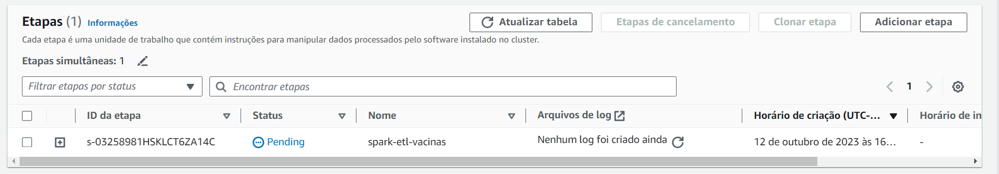

11. Verifique no bucket de dados, na pasta `output/spark` se o arquivo foi atualizado

12.	Agora vamos adicionar uma etapa para o Hive

13.	Clique em  para adicionar mais uma etapa 

14.	No popup configure a etapa como na imagem abaixo e clique em . O campo 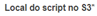 deve apontar para o script `hive_consulta_vacinas.hql` no bucket de deploy.


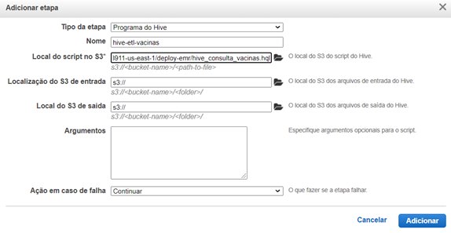

15.	Acompanhe a execução da etapa até que o Status seja . Clique em  de vez em quando para atualizar os registros.

16.	Verifique na tabela do DynamoDB se os registros foram incluídos.

## Finalização do Laboratório

Termine o cluster do EMR para economizar recursos da sua conta.


<div class="footer">
    &copy; 2022 Fernando Sousa
    <br/>
    
Last update: 2023-10-12 18:59:22
</div>