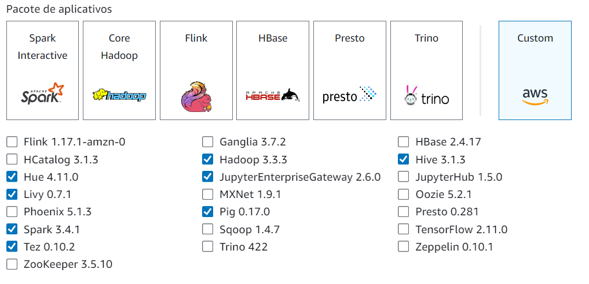
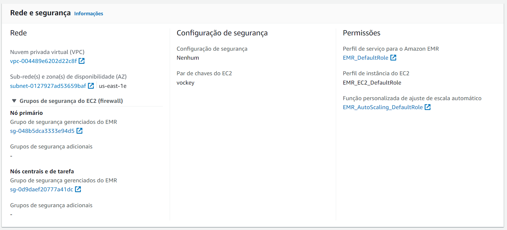
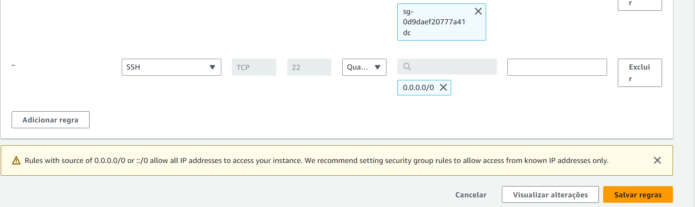
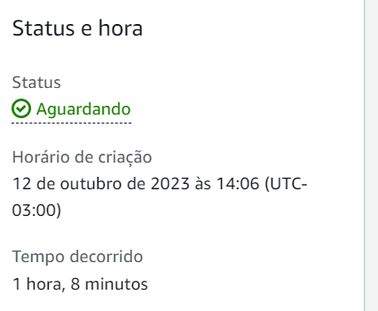
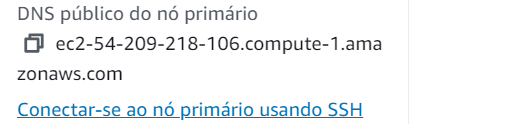

# DataOps - Laboratório 7

Processmento e Análise de Dados com Amazon EMR

As instruções do laboratório estão em português. Para alterar o idioma, procure a opção na barra inferior do console AWS.


## Objetivos

* Utilizar AWS EMR para ler um arquivo do S3

* Utilizar Apache Hive para fazer consulta nos dados

* Exportar dados para DynamoDB


## Arquitetura da solução


## Criar um cluster EMR

Amazon EMR é o serviço da AWS que provisiona Hadoop MapReduce e outras soluções de análise de dados em clusters de instâncias AWS. Vamos provisionar um cluster EMR com um nó Principal, que controla as execuções, e dois nós de Serviço, que realmente executam as tarefas.

1. Procure na barra superior pelo serviço `EMR` e clique no serviço para abrir

2.	No menu ao lado esquerdo clique em 

3.	Clique no botão  que aparece na parte superior para iniciar a criação de um novo cluster EMR

4.	Na tela de criação do cluster, clique no link 

5.	O primeiro passo é configurar os softwares (Step 1: Software e etapas)

6.	Em  selecione as opções:

    a. 	  

    b. 

    c. 

    d. 

Mantenha os que já estavam selecionados (Hadoop, Hive, Hue e Pig). Pode ser que a versão seja diferente




7. Em  selecione as duas opções disponíveis para importar o catálogo de dados do Glue


8. Va até o final da página e clique em 

9.	A próximo passo é a configuração do Hardware (Step2: Hardware). 

    9.1. Na seção  clique nas opções `Spot` na última coluna para os nós `Principal` e `Serviços`. Assim economizaremos com a execução de instâncias EC2 para o cluster EMR.
    A configuração cria 1 nó principal (master) e 2 nós de serviço (core). O nó principal distribui as tarefas e os nós de serviço são responsáveis por executá-las.

    

    9.2. Clique em  no final da página

10.	Na próxima tela (Step 3 – Configurações gerais do cluster), configure o seguinte:

    10.1. Nome do cluster: `ClusterVacinas`

    10.2. Clique em 

11.	Na próxima tela (Step 4 - Segurança), em  selecione 

12.	Clique em 

13.	 Aguarde até que o cluster seja criado, quando o status estiver mostrando `Aguardando`. Clique em  no canto superior direito, de vez em quando, para atualizar. O processo pode levar até 20 minutos.


14.	Enquanto o cluster inicia vamos configurar o grupo de segurança para poder acessar a instância principal do cluster EMR a partir de uma conexão SSH no CloudShell

    14.1. Na tela de detalhes do cluster EMR (tela aberta depois que o cluster foi criado) procure pela seção "Segurança e acesso" e identifique a propriedade "“"Grupos de segurança para o Principal"

    

    14.2. Clique no link ao lado da propriedade, que começa com sg- para abrir o grupo de segurança (security group)

    14.3. Na nova tela identifique o grupo de segurança com o valor `ElasticMapReduce-master` na coluna `Nome do grupo de segurança`. Clique no checkbox para selecioná-lo

    


    14.4. Nas abas da parte inferior, selecione a aba 

    


    14.5. Clique em 

    14.6. Na nova tela, clique em 

    14.7. Na nova regra habilite a porta 22 (SSH) com as seguintes configurações:

&nbsp;&nbsp;&nbsp;&nbsp;&nbsp;&nbsp;&nbsp;&nbsp;a. Intervalo de portas: 22

&nbsp;&nbsp;&nbsp;&nbsp;&nbsp;&nbsp;&nbsp;&nbsp;b. Origem: 

&nbsp;&nbsp;&nbsp;&nbsp;14.8. Clique novamente em  para adicionar mais uma regra

&nbsp;&nbsp;&nbsp;&nbsp;14.9. Na nova regra habilite a porta 9443 com as seguintes configurações:

&nbsp;&nbsp;&nbsp;&nbsp;&nbsp;&nbsp;&nbsp;&nbsp;a.	Intervalo de portas: 9443

&nbsp;&nbsp;&nbsp;&nbsp;&nbsp;&nbsp;&nbsp;&nbsp;b.	Origem: 

&nbsp;&nbsp;&nbsp;&nbsp;&nbsp;&nbsp;&nbsp;&nbsp;Obs: Habilitando a regra somente para `Meu IP`, será retornado o IP atual da sua re-de. Caso não consiga conectar no Jupyter Notebook nas próximas partes do lab, faça o procedimento de liberar a porta 9443 novamente, para pegar seu novo IP

&nbsp;&nbsp;&nbsp;&nbsp;14.10. Clique em  

&nbsp;&nbsp;&nbsp;&nbsp;

15.	Volte para o EMR e veja se já está com o status `Aguardando`


 
16.	Para finalizar, conecte na instância utilizando o CloudShell. Siga os passos abaixo, se ficar alguma dúvida consulte o [Laboratório 4](https://github.com/fesousa/dataops-lab4) para mais detalhes

    16.1. Ainda no EMR, copie o endereço da propriedade `DNS público principal`. Deve ser algo parecido com o seguinte: `ec2-52-55-234-193.compute-1.amazonaws.com`

    
 
    16.2. No console da AWS acesse ao CloudShell clicando em  na barra superior

    16.3. Aguarde o terminal ser iniciado e verifique se o arquivo `labsuser.pem` existe executando o comando `ls`

    
 
    Caso não tenha o arquivo, veja no [Laboratório 4](https://github.com/fesousa/dataops-lab4)como fazer o upload.

    16.4. Acesso o cluster do EMR via SSH, similar como fez para conectar na instância EC2 do Jenkins. O comando é o seguinte:

    ```bash
    ssh -i labsuser.pem hadoop@<DNS_EMR>
    ```

    Troque `<DNS_EMR>` pelo endereço copiado no passo 16.1

    16.5. Depois de executado o comando, digite `yes` para confirma a conexão

    
 
    16.6. Você deverá ver o seguinte no CloudShell

    
 

## Executar ETL com Spark no EMR

1.	No VS Code, crie uma pasta lab7 na sua pasta de projetos da disciplina

2.	Na pasta lab7 crie um arquivo chamado `spark-etl-vacinas.py` e coloque o código abaixo. É um código python que utiliza o pyspark para fazer um processo de ETL com os dados de vacinas que estão no S3:
    
    2.1. Lê os dados de vacinas do S3 (extract)

    2.2. Faz transformações nos dados (seleciona colunas, renomeia colunas e faz a conta-gem dos dados agrupados - transform)

    2.3. Dalva os dados transformados no formato parquet no S3 (load)

    https://github.com/fesousa/dataops-lab7/blob/854f30cbcf24cf53d327b78d7789fc3424d1ba8b/spark-etl-vacinas.py#L1-L59

3.	Crie um novo repositório (dataops-lab7) no seu Github e envie o arquivo para o repositório na branch principal (lembre-se dos passos seguidos em labs anteriores)

4.	Volte ao CloudShell, onde está conectado no EMR e faça o seguinte:

    4.1. Verifique se a conexão ainda está ativa. Se não, abra o CloudShell novamente e reconecte no EMR como fizemos anteriormente neste laboratório

    4.2. Já conectado no EMR, instale o Git

    ```bash
    yum install git
    ```

    4.3. Verifique a instalação do git

    ```bash
    git –version
    ```

    Você deve ver a versão do Git no console do CloudShell

    

    4.4. Faça o clone do repositório criado neste laboratório

    ```bash
    git clone <url-repositorio>
    ```

    Se você criou um repositório privado, será necessário a autenticação. Para isso, é preciso criar um token quando for solicitada a senha no console do AWS CloudShell. Siga essa documentação para criar o token: https://docs.github.com/pt/github/authenticating-to-github/keeping-your-account-and-data-secure/creating-a-personal-access-token. O nome do usuário é o mesmo usuário do seu git. 

    


    4.5. Acesse a pasta do repositório clonado

    ```bash
    cd dataops-lab7
    ```

    Se criou o repositório com outro nome, a pasta estará diferente no seu EMR 

    4.6. Veja se o arquivo `spark-etl-vacinas.py` está na pasta com o comando `ls`

    


    4.7. Execute o script pyspark `spark-etl-vacinas.py` com o comando `spark-submit`:

    ```bash
    spark-submit spark-etl-vacinas.py s3://dataops-dados-nomesobrenome/input/ s3://dataops-impacta-dados-nomesobrenome/output/spark
    ```

    Lembre-se de trocar `dataops-dados-nomesobrenome` pelo seu bucket de dados (bucket criado no [Laboratório 1](https://github.com/fesousa/dataops-lab1)). Os caminhos de bucket s3 que vem depois do nome do arquivo são os parâmetros do script. O primeiro é a origem dos dados (arquivo CSV com dados brutos) e o segundo é o destino (arquivo parquet transformado). Esses parâmetros são recebidos na variável `sys.argv` no código criado. Volte ao código e identifique o uso.

    4.8. Verifique se a execução completou corretamente 

&nbsp;&nbsp;&nbsp;&nbsp;&nbsp;&nbsp;&nbsp;&nbsp;a. Verifique o log de execução no console do CloudShell e veja se não houve nenhuma exceção

&nbsp;&nbsp;&nbsp;&nbsp;&nbsp;&nbsp;&nbsp;&nbsp;b. Abra o bucket do S3 e veja se a pasta `output/spark/` foi criada com o conteúdo do parquet


## Utilizar Hive para consultar dados do Glue Data Catalog

O Apache Hive é um data warehouse e pacote analítico de código aberto. Ele facilita a leitura, escrita e gerenciamento de grandes bases de dados em armazenamento distribuídos como o Hadoop. O Hive abstrai as cargas de trabalho que utilizam Spark e MapReduce, a partir de comando SQLike (HiveQL). Com o Hive instalado no EMR é possível aproveitar as bases de dados e tabelas do catálogo de dados do Glue (Glue data catalog). Essa configuração foi feita na criação do cluster EMR. Assim podemos criar um datalake a partir de di-versas fontes de dados utilizando o Crawler e o Data Catalog do Glue, e fazer uma consulta em todas essas bases utilizando o Hive no EMR.


1. Ainda no CloudShell e conectado no cluster do EMR execute o CLI do Hive com o comando `hive;` 


2. Dentro do Hive execute o comando abaixo para listar as bases de dados. Você deverá ver a base `vacinas_database`, criada no Glue. Se não vir a base, verifique se a base existe no Glue. Se precisar recriar, consulte o [Laboratório 6](https://github.com/fesousa/dataops-lab6).

```sql
show databases;
```


3.	Abra a base `vacinas_database`:

```sql
use vacinas_database;
```


4. Agora você pode executar consultas SQL nas tabelas mapeadas no Glue, que podem vir de diferentes origens (S3, RDS, Redshift, MongoDB, DocumentDB, Kafka, etc), utilizando o processamento distribuído do Hadoop no EMR. Por exemplo, consultar a quantidade de registros na tabela `vacinas_input`, que foi criada a partir do arquivo csv no S3.

```sql
select count(1) from vacinas_input;
```


Ou então consultar quantos registros existem por UF:

```sql
select estabelecimento_uf, count(1) from vacinas_input group by estabelecimento_uf;
```


5.	Por estar utilizando o Data Catalog do Glue, quando os dados mudam na origem, a consulta em qualquer outra ferramenta que utiliza o catálogo, vai retornar os dados atualizados. Faça o teste:

    5.1. Execute a função lambda de coleta criada no [Laboratório 4](https://github.com/fesousa/dataops-lab4) para coletar os dados de Roraima (RR) deste link: https://s3.sa-east-1.amazonaws.com/ckan.saude.gov.br/SIPNI/COVID/uf/uf%3DRR/part-00000-a02ab466-c323-4420-85f1-e51e77685fe4.c000.csv. Consulte o  [Laboratório 4](https://github.com/fesousa/dataops-lab4) para relembrar como enviar os parâmetros.

    5.2. Quando a função terminar, volte ao CloudShell para executar novamente a última consulta (quantidade de registros por UF) e veja o novo resultado, com os dados de Roraima.


## Utilizar EMR Steps para executar tarefas de Spark e Hive

O EMR consegue ser programado para executar etapas de operações de ETL a partir de códigos que estão no S3 

1.	Crie um novo script HiveQL para executar no Hive

    a.	No VSCode adicione um novo arquivo chamado `hive_consulta_vacinas.hql` na pasta lab7 com o seguinte código de HiveQL. Ele deve estar na mesma pasta do arquivo spark-etl-vacinas.py para podermos enviar para o repositório do Github.


<div class="footer">
    &copy; 2022 Fernando Sousa
    <br/>
    
Last update: 2022-04-03 16:09:11
</div>